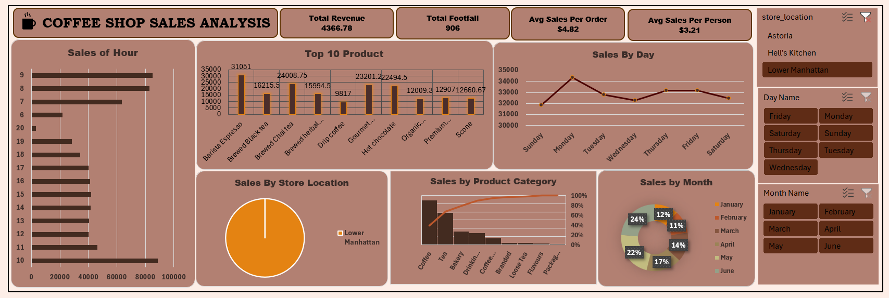
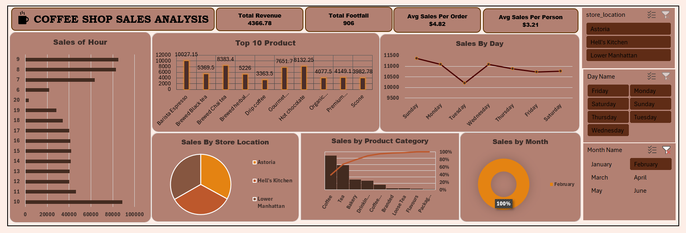

# Excel_Project_Hub
# ☕ Coffee Shop Sales Analysis (Excel Project)

This project delivers an in-depth analysis of coffee shop sales data using **Microsoft Excel**. The primary objective is to convert raw sales data into meaningful insights through a well-structured and interactive dashboard.

The dashboard evaluates sales performance across **multiple store locations**, helping identify top-performing and low-performing branches. **Pivot Tables and Pivot Charts** are used to efficiently summarize and visualize key sales metrics.

To improve usability, **Slicers** are implemented for **Store Location, Weekly, and Monthly analysis**, allowing users to dynamically filter the data. Key Performance Indicators (KPIs) such as **Total Revenue**, **Total Footfall**,**Avg Sales Per Order ** and **Avg Sales Per Person** provide a quick overview of business performance 📊.

Weekly sales analysis highlights peak and slow periods, while month-wise analysis reveals **seasonal trends and growth patterns** 📈. The dashboard updates automatically based on slicer selections, ensuring real-time insights.

This project demonstrates strong skills in **Excel data analysis, dashboard development, and business reporting**, making it suitable for **Data Analyst and Business Analyst portfolios** 💼.

📁 Tool Used: Microsoft Excel (Pivot Tables, Pivot Charts, Slicers)

## 📸 Dashboard Screenshot

   
 📊 Overall Dashboard Analysis – A unified view of key sales metrics and trends across all store locations and time periods.

  

    
  

  
📍 Store Location Analysis – Comparison of total sales performance across all store branches.

  

    
  

  
🗓 Monthly Sales Analysis – Month-wise comparison of total sales across the year.

  

    
  

